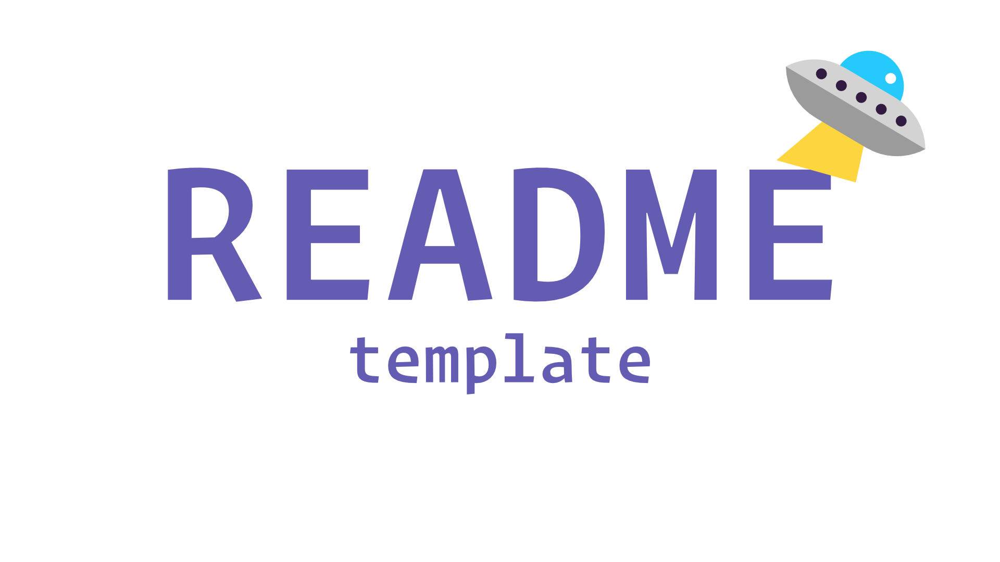

<div id="top" />

<!-- PROJECT LOGO -->
<br />
<div align="center">
  <a href="https://github.com/MylesWritesCode/rust-cli-starter">
    
  </a>

<h3 align="center">Rig Service</h3>

  <p align="center">
    The agentic service for Memoir
    <br />
    <a href="https://github.com/MylesWritesCode/rust-cli-starter">
      <strong>Explore the docs »</strong>
    </a>
    <br />
    <br />
    <a href="https://github.com/MylesWritesCode/rust-cli-starter">View Demo</a>
    ·
    <a href="https://github.com/MylesWritesCode/rust-cli-starter/issues">Report Bug</a>
    ·
    <a href="https://github.com/MylesWritesCode/rust-cli-starter/issues">Request Feature</a>
  </p>
</div>

<!-- TABLE OF CONTENTS -->
<details>
  <summary>Table of Contents</summary>
  <ol>
    <li>
      <a href="#about-the-project">About The Project</a>
      <ul>
        <li><a href="#built-with">Built With</a></li>
      </ul>
    </li>
    <li>
      <a href="#getting-started">Getting Started</a>
      <ul>
        <li><a href="#prerequisites">Prerequisites</a></li>
        <li><a href="#installation">Installation</a></li>
      </ul>
    </li>
    <li><a href="#usage">Usage</a></li>
    <li><a href="#roadmap">Roadmap</a></li>
    <li><a href="#contributing">Contributing</a></li>
    <li><a href="#license">License</a></li>
    <li><a href="#contact">Contact</a></li>
    <li><a href="#acknowledgments">Acknowledgments</a></li>
  </ol>
</details>

<!-- ABOUT THE PROJECT -->

## About The Project

This is the agent service for Memoir. Rig service contains all the agentic
and llm code. It's used by the UI to facilitate the user's assistant and agent
chats.

<p align="right">(<a href="#top">back to top</a>)</p>

### Built With

- [Clap](https://github.com/clap-rs/clap)
- [rig](https://github.com/0xPlaygrounds/rig)

<p align="right">(<a href="#top">back to top</a>)</p>

<!-- GETTING STARTED -->

## Getting Started

Rig service needs environment variables (found in [.env.example][env]) and all
the services in the [docker compose][dc] running. Additionally, if you're using
Ollama for any of the default models, you'll need to go into the Ollama
container and pull the models:

[env]: ./.env.example
[dc]: ../../docker-compose.yml

```sh
# If using ollama:
docker compose --profile ai up -d
docker compose exec -it ollama /bin/sh
ollama pull <your-model>
```

If you're not using Ollama, it should just work.

### Prerequisites

- [Rust](https://rust-lang.org)

<p align="right">(<a href="#top">back to top</a>)</p>
<!-- USAGE EXAMPLES -->

## Usage

This repo is meant to be used as a template for Rust CLI programs. Metadata
files will be within the `.meta` folder. In there, you'll find places to put
your project logo and screenshot. Importantly, you'll find a fresh README.md
that you can use to overwrite this one.

Happy hacking!

_For more examples, please refer to the [Documentation](https://example.com)_

<p align="right">(<a href="#top">back to top</a>)</p>

<!-- ROADMAP -->

## Roadmap

- [ ] Feature 1
- [ ] Feature 2
- [ ] Feature 3
  - [ ] Nested Feature

See the [open issues](https://github.com/MylesWritesCode/rust-cli-starter/issues) for a full list of proposed features (and known issues).

<p align="right">(<a href="#top">back to top</a>)</p>

<!-- CONTRIBUTING -->

## Contributing

[](https://github.com/MylesWritesCode/rust-cli-starter/graphs/contributors)

Contributions are what make the open source community such an amazing place to learn, inspire, and create. Any contributions you make are **greatly appreciated**.

If you have a suggestion that would make this better, please fork the repo and create a pull request. You can also simply open an issue with the tag "enhancement".
Don't forget to give the project a star! Thanks again!

1. Fork the Project
2. Create your Feature Branch (`git checkout -b feature/AmazingFeature`)
3. Commit your Changes (`git commit -m 'Add some AmazingFeature'`)
4. Push to the Branch (`git push origin feature/AmazingFeature`)
5. Open a Pull Request

<p align="right">(<a href="#top">back to top</a>)</p>

<!-- LICENSE -->

## License

[](https://github.com/MylesWritesCode/rust-wasm/blob/master/LICENSE)

Distributed under the MIT License. See `LICENSE` for more information.

<p align="right">(<a href="#top">back to top</a>)</p>

<!-- CONTACT -->

## Contact

### Myles Berueda

[](https://linkedin.com/in/myles-berueda)
[](https://mstdn.social/@mylesberueda)
[](https://github.com/MylesWritesCode)

<p align="right">(<a href="#top">back to top</a>)</p>

<!-- ACKNOWLEDGMENTS -->

<!-- ## Acknowledgments -->

<!-- - []() -->
<!-- - []() -->
<!-- - []() -->

<!-- <p align="right">(<a href="#top">back to top</a>)</p> -->

<!-- MARKDOWN LINKS & IMAGES -->
